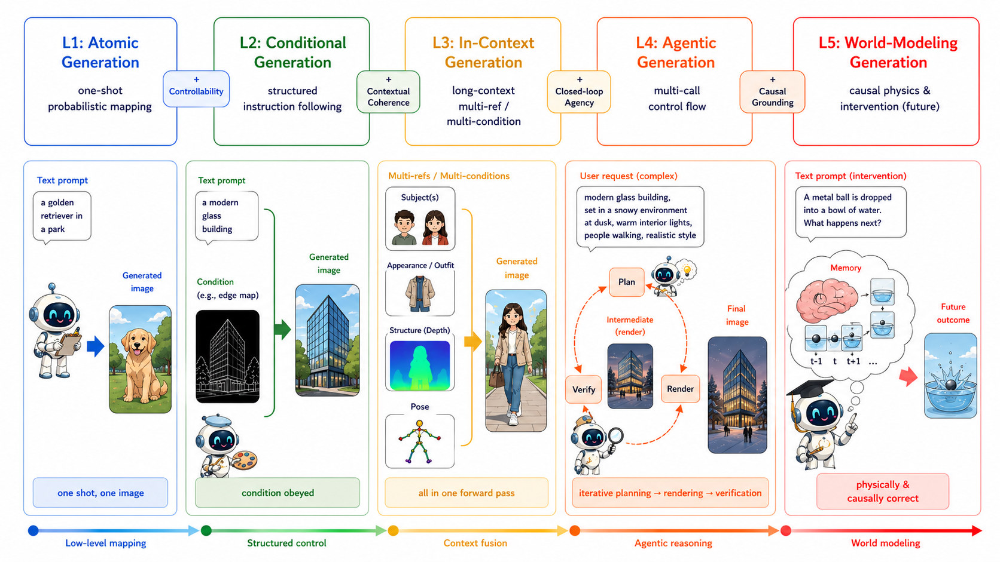
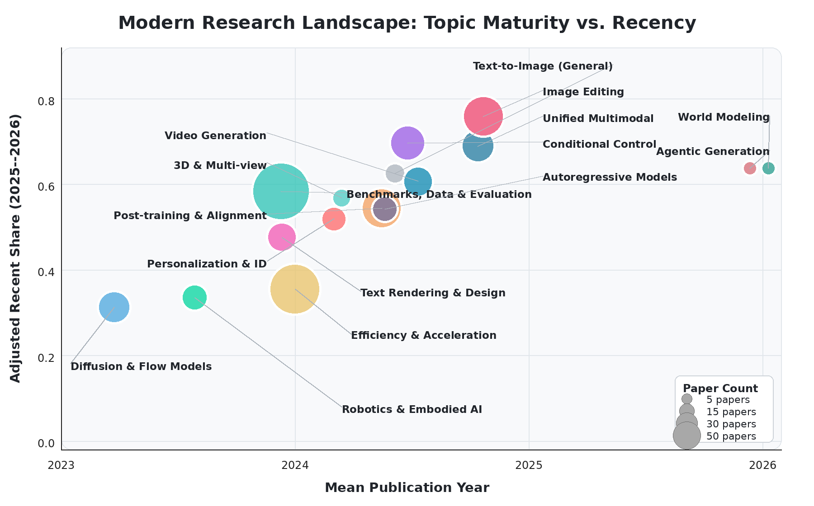
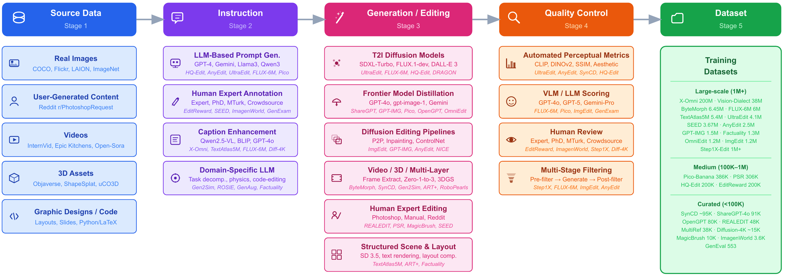
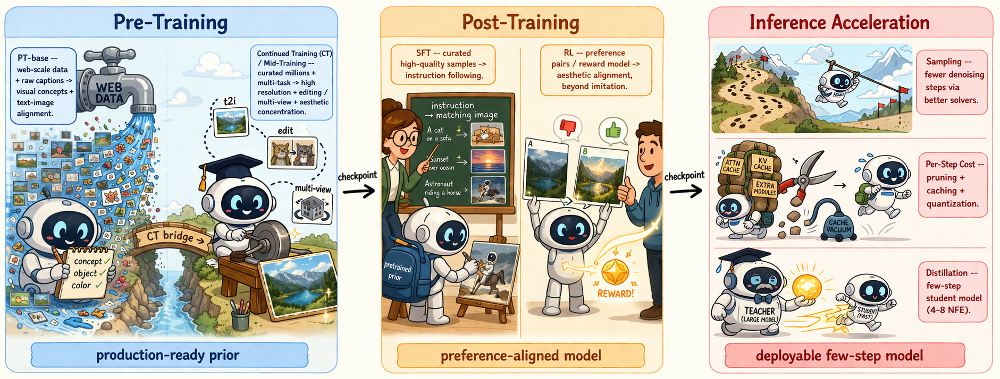

# Visual Generation in the New Era: An Evolution from Atomic Mapping to Agentic World Modeling




**Visual Generation in the New Era: An Evolution from Atomic Mapping to Agentic World Modeling**


<div align="center">

[](https://arxiv.org/abs/2604.28185)
[](https://evolvinglmms-lab.github.io/Evolving-Visual-Generation/)
[](https://github.com/EvolvingLMMs-Lab/Evolving-Visual-Generation)
[](https://huggingface.co/papers/2604.28185)
<!-- [](https://www.lmms-lab.com/posts/longvt/) -->
</div>

<!-- [](https://awesome.re) [](https://arxiv.org/abs/2604.28185)  [](https://huggingface.co/papers/2604.28185)  omit in toc -->

<!-- [](https://x.com/_akhaliq/status/2048805921485148284) [](https://x.com/dotey/status/2049187740084731991) -->

This repository hosts a living roadmap on modern visual generation. The project organizes recent progress in image generation and editing around a capability-oriented view of **visual intelligence**: moving from one-shot appearance synthesis toward controllable composition, persistent context, agentic interaction, and causal world modeling.

A companion [**Visual Generation Roadmap**](https://evolvinglmms-lab.github.io/Evolving-Visual-Generation/) project page is available, which carries a richer visualization of the taxonomy, the modern research landscape, and the full gallery of stress-test cases. The roadmap is intended to grow with the community: if you have a paper that should be included, or notice a missing reference or mis-classification, please feel free to open a pull request or an issue, and we will keep updating both the survey and the project page accordingly. If you find any part of this work useful or interesting, we would also be very happy if you consider [citing it](#citation).


## Core Thesis

Recent visual generation models have improved photorealism and instruction following, but stronger images do not automatically imply stronger visual intelligence. The next bottlenecks are structural, temporal, and causal: models must preserve identity, obey spatial constraints, render exact symbols, reason over external data, interact through closed loops, and verify that generated artifacts satisfy the intended constraints.

We frame this evolution as a five-level progression:

| Level | Capability | Short Description |
| --- | --- | --- |
| L1 | **Atomic Generation** | One-shot probabilistic rendering from prompts or latent codes. |
| L2 | **Conditional Generation** | Faithful generation under explicit controls, layouts, references, or constraints. |
| L3 | **In-Context Generation** | Multi-reference, multi-condition, and long-context generation with persistent state. |
| L4 | **Agentic Generation** | Multi-call planning, generation, verification, rollback, and tool use. |
| L5 | **World-Modeling Generation** | Causal, physical, and action-conditioned simulation of visual worlds. |

## What Is in This Repo

- [`docs/taxonomy.md`](docs/taxonomy.md): the five-level taxonomy of visual intelligence.
- [`docs/technical_drivers.md`](docs/technical_drivers.md): generative paradigms, architectures, and unified understanding-generation systems.
- [`docs/training_data_alignment.md`](docs/training_data_alignment.md): data construction, pre-training, post-training, reward modeling, and acceleration.
- [`docs/applications.md`](docs/applications.md): controllability, personalization, editing, embodied generation, and data-centric visualization.
- [`docs/stress_tests.md`](docs/stress_tests.md): in-the-wild stress tests that expose failures beyond visual realism.
- [`docs/frontiers.md`](docs/frontiers.md): open positions on visual CoT, closed-loop agents, tool-augmented rendering, synthetic self-play, and world simulation.
- [`docs/reading_list.md`](docs/reading_list.md): a curated entry point into the cited literature.
- [`references/citation.bib`](references/citation.bib): BibTeX references used by the roadmap.

## Roadmap at a Glance

The roadmap argues that progress is no longer a single axis of image fidelity. It is a nested expansion of capability:

1. **Modeling** moves from GANs to diffusion, flow matching, autoregressive modeling, and hybrid AR-diffusion systems.
2. **Architecture** converges toward tokenizers/VAEs, transformer backbones, condition modules, and multimodal fusion mechanisms.
3. **Training** shifts from scale alone to data density, VLM relabeling, continued training, SFT, preference optimization, and deployment acceleration.
4. **Applications** increasingly demand verifiable constraints: exact text, layout, identity, domain rules, external data, and physical interaction.
5. **Evaluation** must move from perceptual similarity toward parsers, OCR, graph validators, simulators, theorem checkers, and red-team agents.

## Selected Figures

| Topic | Figure |
| --- | --- |
| Research landscape |  |
| Modeling paradigms |  |
| Data pipeline |  |
| Training pipeline |  |

## Stress-Test Examples

Standard metrics can miss failures that matter. This repo includes selected qualitative cases where outputs are visually polished but violate geometric, topological, physical, or procedural constraints.

| Test | Target Capability | Typical Failure |
| --- | --- | --- |
| Jigsaw reconstruction | Spatial structuring | Hallucinates plausible content instead of rigidly reassembling pieces. |
| Metro map | Graph/topology following | Produces a convincing map but violates transfer and crossing constraints. |
| Isometric tile map | Coordinate grounding | Places objects in nearby but incorrect grid cells. |
| Fluid dynamics | Causal state transition | Must distinguish plausible appearance from physically faithful intervention. |
| Multi-turn editing | Persistent identity and constraint memory across turns | Drifts in identity, layout, or previously satisfied constraints as edits accumulate; later turns silently undo earlier ones. |
| Long-form text rendering | Exact symbolic rendering and typography | Generates near-correct glyphs with character-level errors, swapped digits, or inconsistent fonts in long strings. |
| Counting and quantity | Numerical grounding | Produces a visually plausible scene with the wrong number of instances when the prompt specifies an exact count. |
| Occlusion and depth ordering | 3D-consistent compositional reasoning | Renders objects with mutually inconsistent occlusion or depth cues that violate a single 3D layout. |
| Compositional binding | Attribute-to-entity binding | Swaps or merges colors, materials, and parts across multiple bound entities in the same scene. |

The full gallery, including more multi-turn editing cases, is hosted on the [project page](https://evolvinglmms-lab.github.io/Evolving-Visual-Generation/#stress-tests); see [`docs/stress_tests.md`](docs/stress_tests.md) for additional details.

## Reference Organization

The full bibliography is maintained in [`references/citation.bib`](references/citation.bib). The list below follows the roadmap sections and uses an awesome-list style: each entry gives the concrete paper name, a paper link when available (preferably arXiv), venue/year, and a short role in the roadmap.

### Sec. 1: Motivation and New-Era Visual Generation

+ [**High-Resolution Image Synthesis with Latent Diffusion Models**](https://arxiv.org/abs/2112.10752) (arXiv, 2022) — Latent diffusion foundation for high-resolution text-to-image synthesis.
+ [**Flow straight and fast: Learning to generate and transfer data with rectified flow**](https://arxiv.org/abs/2209.03003) (arXiv, 2022) — Rectified-flow view of fast straight generative transport.
+ [**Flow Matching for Generative Modeling**](https://arxiv.org/abs/2210.02747) (arXiv, 2023) — General flow-matching objective for continuous generative modeling.
+ [**Scaling Rectified Flow Transformers for High-Resolution Image Synthesis**](https://arxiv.org/abs/2403.03206) (arXiv, 2024) — MM-DiT / rectified-flow scaling recipe behind Stable Diffusion 3.
+ [**Qwen-image technical report**](https://arxiv.org/abs/2508.02324) (arXiv, 2025) — Frontier image-generation technical report with strong text rendering and alignment.
+ [**Z-image: An efficient image generation foundation model with single-stream diffusion transformer**](https://arxiv.org/abs/2511.22699) (arXiv, 2025) — Efficient single-stream DiT image foundation model and training recipe.
+ [**X-Omni: Reinforcement Learning Makes Discrete Autoregressive Image Generative Models Great Again**](https://arxiv.org/abs/2507.22058) (arXiv, 2025) — Discrete autoregressive unified understanding-and-generation model.
+ [**BLIP3o-NEXT: Next Frontier of Native Image Generation**](https://arxiv.org/abs/2510.15857) (arXiv, 2025) — Native multimodal image-generation system in the BLIP3o line.
+ [**Unified Multimodal Model as Auto-Encoder**](https://arxiv.org/abs/2509.09666) (arXiv, 2025) — Unified multimodal auto-encoding formulation for understanding and generation.

### Sec. 2: Five-Level Taxonomy of Visual Intelligence

+ **Denoising diffusion probabilistic models** (NeurIPS, 2020) — Atomic diffusion generation baseline.
+ **Zero-shot text-to-image generation** (ICML, 2021) — Early large-scale zero-shot text-to-image generation.
+ [**Adding Conditional Control to Text-to-Image Diffusion Models**](https://arxiv.org/abs/2302.05543) (arXiv, 2023) — Canonical conditional-control framework for diffusion models.
+ [**Ip-adapter: Text compatible image prompt adapter for text-to-image diffusion models**](https://arxiv.org/abs/2308.06721) (arXiv, 2023) — Reference-image adapter for text-compatible conditioning.
+ **Dreambooth: Fine tuning text-to-image diffusion models for subject-driven generation** (CVPR, 2023) — Subject-driven personalization through model fine-tuning.
+ [**Instantid: Zero-shot identity-preserving generation in seconds**](https://arxiv.org/abs/2401.07519) (arXiv, 2024) — Identity-preserving generation without per-subject tuning.
+ [**ReasonGen-R1: CoT for Autoregressive Image generation models through SFT and RL**](https://arxiv.org/abs/2505.24875) (arXiv, 2025) — Visual chain-of-thought and RL for autoregressive image generation.
+ [**T2i-r1: Reinforcing image generation with collaborative semantic-level and token-level cot**](https://arxiv.org/abs/2505.00703) (arXiv, 2025) — Semantic-level and token-level CoT reinforcement for T2I.
+ [**GEMS: Agent-Native Multimodal Generation with Memory and Skills**](https://arxiv.org/abs/2603.28088) (arXiv, 2026) — Agent-native multimodal generation with memory and skills.
+ [**Gen-Searcher: Reinforcing Agentic Search for Image Generation**](https://arxiv.org/abs/2603.28767) (arXiv, 2026) — Search-augmented agentic image generation.
+ [**Jarvisart: Liberating human artistic creativity via an intelligent photo retouching agent**](https://arxiv.org/abs/2506.17612) (arXiv, 2025) — Agent-to-software protocol for professional retouching.
+ **Genie: Generative Interactive Environments** (ICML, 2024) — Latent-action interactive environments from Internet videos.
+ **Genie 2: A Large-Scale Foundation World Model** (Google DeepMind Blog Post, 2024) — Large-scale foundation world model for interactive visual environments.
+ [**Diffusion models are real-time game engines**](https://arxiv.org/abs/2408.14837) (arXiv, 2024) — Real-time neural game engine using diffusion dynamics.
+ **Learning interactive real-world simulators** (ICLR, 2024) — Universal interactive simulator learned from real-world experience.

### Sec. 3: Modeling Paradigms and Architectures

+ [**Generative Adversarial Networks**](https://arxiv.org/abs/1406.2661) (arXiv, 2014) — Foundational adversarial generator-discriminator formulation.
+ [**Score-Based Generative Modeling through Stochastic Differential Equations**](https://arxiv.org/abs/2011.13456) (arXiv, 2021) — Score-based generative modeling via stochastic differential equations.
+ [**Autoregressive Model Beats Diffusion: Llama for Scalable Image Generation**](https://arxiv.org/abs/2406.06525) (arXiv, 2024) — Llama-style autoregressive image generation at scale.
+ [**Visual Autoregressive Modeling: Scalable Image Generation via Next-Scale Prediction**](https://arxiv.org/abs/2404.02905) (arXiv, 2024) — VAR next-scale prediction for scalable visual autoregression.
+ [**Chameleon: Mixed-Modal Early-Fusion Foundation Models**](https://arxiv.org/abs/2405.09818) (arXiv, 2024) — Early-fusion mixed-modal foundation model.
+ [**Emu3: Next-Token Prediction is All You Need**](https://arxiv.org/abs/2409.18869) (arXiv, 2024) — Next-token prediction for unified image/video/text modeling.
+ [**Transfusion: Predict the Next Token and Diffuse Images with One Multi-Modal Model**](https://arxiv.org/abs/2408.11039) (arXiv, 2024) — Hybrid next-token prediction plus diffusion image generation.
+ [**Show-o: One Single Transformer to Unify Multimodal Understanding and Generation**](https://arxiv.org/abs/2408.12528) (arXiv, 2024) — Single-transformer unification of multimodal understanding and generation.
+ [**JanusFlow: Harmonizing Autoregression and Rectified Flow for Unified Multimodal Understanding and Generation**](https://arxiv.org/abs/2411.07975) (arXiv, 2024) — Autoregression plus rectified flow for unified multimodal modeling.
+ **Autoregressive image generation without vector quantization** (NeurIPS, 2024) — Continuous-token autoregressive image generation without vector quantization.
+ [**Nextstep-1: Toward autoregressive image generation with continuous tokens at scale**](https://arxiv.org/abs/2508.10711) (arXiv, 2025) — Continuous-token autoregressive image generation at scale.
+ [**Hunyuanimage 3.0 technical report**](https://arxiv.org/abs/2509.23951) (arXiv, 2025) — Industrial-scale sparse MoE image-generation technical report.
+ [**Seedream 4.0: Toward next-generation multimodal image generation**](https://arxiv.org/abs/2509.20427) (arXiv, 2025) — Multimodal image-generation system emphasizing editing and high resolution.
+ [**Wan-Image: Pushing the Boundaries of Generative Visual Intelligence**](https://arxiv.org/abs/2604.19858) (arXiv, 2026) — Frontier visual-intelligence technical report across generation and editing.
+ [**LongCat-Next: Lexicalizing Modalities as Discrete Tokens**](https://arxiv.org/abs/2603.27538) (arXiv, 2026) — Discrete-token multimodal system bridging language and vision.
+ **JoyAI-Image: Awakening Spatial Intelligence in Unified Multimodal Understanding and Generation** (Paper, 2026) — Unified multimodal model with spatial-intelligence emphasis.

### Sec. 4: Training, Alignment, and Acceleration

+ **InstructPix2Pix: Learning to Follow Image Editing Instructions** (CVPR, 2023) — Instruction-following image editing from paired synthetic data.
+ [**Seed-data-edit technical report: A hybrid dataset for instructional image editing**](https://arxiv.org/abs/2405.04007) (arXiv, 2024) — Hybrid instructional image-editing dataset and production recipe.
+ [**Training diffusion models with reinforcement learning**](https://arxiv.org/abs/2305.13301) (arXiv, 2023) — RL formulation for aligning diffusion models.
+ **DPOK: Reinforcement learning for fine-tuning text-to-image diffusion models** (NeurIPS, 2023) — DPOK reinforcement learning for T2I diffusion fine-tuning.
+ [**Aligning text-to-image diffusion models with reward backpropagation**](https://arxiv.org/abs/2310.03739) (arXiv, 2023) — Reward backpropagation for text-to-image alignment.
+ **Diffusion model alignment using direct preference optimization** (CVPR, 2024) — Direct preference optimization for diffusion model alignment.
+ [**Dancegrpo: Unleashing grpo on visual generation**](https://arxiv.org/abs/2505.07818) (arXiv, 2025) — GRPO-style optimization for visual generation.
+ **Hpsv3: Towards wide-spectrum human preference score** (ICCV, 2025) — Wide-spectrum human-preference scoring for generated images.
+ [**Visionreward: Fine-grained multi-dimensional human preference learning for image and video generation**](https://arxiv.org/abs/2412.21059) (arXiv, 2024) — Fine-grained multidimensional reward model for image/video generation.
+ [**Editreward: A human-aligned reward model for instruction-guided image editing**](https://arxiv.org/abs/2509.26346) (arXiv, 2025) — Human-aligned reward model for instruction-guided editing.
+ **DPM-Solver: A Fast ODE Solver for Diffusion Probabilistic Model Sampling in Around 10 Steps** (NeurIPS, 2022) — Fast high-order ODE solver for diffusion sampling.
+ **Deepcache: Accelerating diffusion models for free** (CVPR, 2024) — Feature caching for free acceleration of diffusion inference.
+ [**Transition Matching Distillation for Fast Video Generation**](https://arxiv.org/abs/2601.09881) (arXiv, 2026) — Transition-matching distillation for fast video generation.

### Sec. 5: Data, Benchmarks, and Infrastructure

+ **Laion-5b: An open large-scale dataset for training next generation image-text models** (NeurIPS, 2022) — Open large-scale image-text corpus for foundation training.
+ **COYO-700M: Image-Text Pair Dataset** (Paper, 2022) — Web-scale image-text pair dataset.
+ **Datacomp: In search of the next generation of multimodal datasets** (NeurIPS, 2023) — Data filtering and composition benchmark for multimodal datasets.
+ [**Sharegpt-4o-image: Aligning multimodal models with gpt-4o-level image generation**](https://arxiv.org/abs/2506.18095) (arXiv, 2025) — GPT-4o-level image-generation distillation dataset.
+ [**Pico-banana-400k: A large-scale dataset for text-guided image editing**](https://arxiv.org/abs/2510.19808) (arXiv, 2025) — Large-scale text-guided image-editing dataset.
+ **Ultraedit: Instruction-based fine-grained image editing at scale** (NeurIPS, 2024) — Instruction-based fine-grained editing at scale.
+ **Anyedit: Mastering unified high-quality image editing for any idea** (CVPR, 2025) — Unified high-quality image editing across task categories.
+ [**Imgedit: A unified image editing dataset and benchmark**](https://arxiv.org/abs/2505.20275) (arXiv, 2025) — Unified image-editing dataset and benchmark.
+ **Editworld: Simulating world dynamics for instruction-following image editing** (ACM MM, 2025) — World-dynamics simulation for instruction-following image editing.
+ [**Textatlas5m: A large-scale dataset for dense text image generation**](https://arxiv.org/abs/2502.07870) (arXiv, 2025) — Dense text-image generation dataset and evaluation resource.
+ [**Flux-reason-6m & prism-bench: A million-scale text-to-image reasoning dataset and comprehensive benchmark**](https://arxiv.org/abs/2509.09680) (arXiv, 2025) — Reasoning-oriented T2I dataset and PRISM benchmark.
+ **Geneval: An object-focused framework for evaluating text-to-image alignment** (NeurIPS, 2023) — Object-focused text-to-image alignment benchmark.
+ **T2i-compbench: A comprehensive benchmark for open-world compositional text-to-image generation** (NeurIPS, 2023) — Compositional text-to-image benchmark.
+ [**GenExam: A Multidisciplinary Text-to-Image Exam**](https://arxiv.org/abs/2509.14232) (arXiv, 2025) — Multidisciplinary exam-style text-to-image benchmark.
+ [**OneIG-Bench: Omni-dimensional Nuanced Evaluation for Image Generation**](https://arxiv.org/abs/2506.07977) (arXiv, 2025) — Omnidimensional image-generation evaluation benchmark.
+ **Chatbot arena: An open platform for evaluating llms by human preference** (ICML, 2024) — Human-preference arena methodology for model comparison.

### Sec. 6: Applications and Evolving Frontiers

+ [**ReCon: Region-Controllable Data Augmentation with Rectification and Alignment for Object Detection**](https://arxiv.org/abs/2510.15783) (arXiv, 2025) — Region-controllable data augmentation and layout control.
+ [**CreatiLayout: Siamese Multimodal Diffusion Transformer for Creative Layout-to-Image Generation**](https://arxiv.org/abs/2412.03859) (arXiv, 2025) — Creative layout-to-image generation with multimodal diffusion transformers.
+ [**Efficient Multi-Instance Generation with Janus-Pro-Driven Prompt Parsing**](https://arxiv.org/abs/2503.21069) (arXiv, 2025) — Multi-instance generation via prompt parsing and lightweight adaptation.
+ **OminiControl: Minimal and Universal Control for Diffusion Transformer** (ICCV, 2025) — Minimal universal control for diffusion transformers.
+ **Easycontrol: Adding efficient and flexible control for diffusion transformer** (ICCV, 2025) — Efficient flexible condition control for diffusion transformers.
+ [**PosterVerse: A Full-Workflow Framework for Commercial-Grade Poster Generation with HTML-Based Scalable Typography**](https://arxiv.org/abs/2601.03993) (arXiv, 2026) — HTML-based full-workflow commercial poster generation.
+ [**PosterCraft: Rethinking High-Quality Aesthetic Poster Generation in a Unified Framework**](https://arxiv.org/abs/2506.10741) (arXiv, 2025) — Unified high-quality aesthetic poster-generation framework.
+ [**Glyph-ByT5-v2: A Strong Aesthetic Baseline for Accurate Multilingual Visual Text Rendering**](https://arxiv.org/abs/2406.10208) (arXiv, 2024) — Accurate multilingual visual text rendering baseline.
+ [**EasyText: Controllable Diffusion Transformer for Multilingual Text Rendering**](https://arxiv.org/abs/2505.24417) (arXiv, 2025) — Controllable multilingual text rendering with diffusion transformers.
+ [**UniGlyph: Unified Segmentation-Conditioned Diffusion for Precise Visual Text Synthesis**](https://arxiv.org/abs/2507.00992) (arXiv, 2025) — Segmentation-conditioned precise glyph synthesis.
+ [**ReChar: Revitalising Characters with Structure Preserved and User-Specified Aesthetic Enhancements**](https://doi.org/10.1145/3757376.3771409) (SIGGRAPH Asia, 2025) — Structure-preserving artistic character generation.
+ [**ReasonEdit: Towards Reasoning-Enhanced Image Editing Models**](https://arxiv.org/abs/2511.22625) (arXiv, 2025) — Reasoning-enhanced image editing.
+ [**Lego-Edit: A General Image Editing Framework with Model-Level Bricks and MLLM Builder**](https://arxiv.org/abs/2509.12883) (arXiv, 2025) — Model-level bricks and MLLM builder for general image editing.
+ [**Step1X-Edit: A Practical Framework for General Image Editing**](https://arxiv.org/abs/2504.17761) (arXiv, 2025) — Practical general-purpose image-editing framework.
+ [**Droid: A large-scale in-the-wild robot manipulation dataset**](https://arxiv.org/abs/2403.12945) (arXiv, 2024) — Large-scale in-the-wild robot manipulation dataset.
+ **Open x-embodiment: Robotic learning datasets and rt-x models: Open x-embodiment collaboration 0** (ICRA, 2024) — Cross-embodiment robotics dataset and RT-X models.
+ [**Video prediction policy: A generalist robot policy with predictive visual representations**](https://arxiv.org/abs/2412.14803) (arXiv, 2024) — Robot policy with predictive visual representations.
+ **Cot-vla: Visual chain-of-thought reasoning for vision-language-action models** (CVPR, 2025) — Visual chain-of-thought reasoning for VLA models.
+ **Learning universal policies via text-guided video generation** (NeurIPS, 2023) — Universal policies learned through text-guided video generation.

### Sec. 7: In-the-Wild Stress Tests

+ **Low-complexity single-image super-resolution based on nonnegative neighbor embedding** (BMVC, 2012) — Classical super-resolution benchmark used for low-level restoration.
+ [**Deep retinex decomposition for low-light enhancement**](https://arxiv.org/abs/1808.04560) (arXiv, 2018) — Low-light enhancement benchmark.
+ **A database of human segmented natural images and its application to evaluating segmentation algorithms and measuring ecological statistics** (ICCV, 2001) — Berkeley segmentation dataset used in denoising/restoration evaluation.
+ **Deep joint rain detection and removal from a single image** (CVPR, 2017) — Rain removal benchmark for deraining stress tests.
+ **Deep multi-scale convolutional neural network for dynamic scene deblurring** (CVPR, 2017) — Dynamic-scene deblurring benchmark.

### Sec. 8: Future Directions

+ [**Beyond Simple Edits: X-Planner for Complex Instruction-Based Image Editing**](https://arxiv.org/abs/2507.05259) (arXiv, 2025) — Planning-based complex instruction image editing.
+ [**MIRA: Multimodal Iterative Reasoning Agent for Image Editing**](https://arxiv.org/abs/2511.21087) (arXiv, 2025) — Multimodal iterative reasoning agent for editing.
+ [**Image Editing As Programs with Diffusion Models**](https://arxiv.org/abs/2506.04158) (arXiv, 2025) — Programmatic view of image editing with diffusion models.
+ [**AI-Generated Images as Data Source: The Dawn of Synthetic Era**](https://arxiv.org/abs/2310.01830) (arXiv, 2023) — Position paper on AI-generated images as synthetic training data.
+ **Recurrent world models facilitate policy evolution** (NeurIPS, 2018) — Early recurrent world model for policy evolution.
+ **Mastering diverse control tasks through world models** (Nature, 2025) — Generalist world-model RL across diverse control tasks.
+ **A path towards autonomous machine intelligence** (Open Review, 2022) — Predictive world-modeling agenda for autonomous intelligence.
+ **Genie: Generative Interactive Environments** (ICML, 2024) — Generative interactive environments from unlabeled videos.
+ **Diffusion for world modeling: Visual details matter in Atari** (NeurIPS, 2024) — Diffusion-based Atari world modeling.
+ **Oasis: A universe in a transformer** (Technical Report, 2024) — Transformer-based interactive Minecraft-like world model.
+ **GameGen-X: Interactive open-world game video generation** (ICLR, 2025) — Interactive open-world game video generation.
+ [**World simulation with video foundation models for physical AI**](https://arxiv.org/abs/2511.00062) (arXiv, 2025) — Video foundation model for physical-AI world simulation.
+ **ST-Raptor: LLM-Powered Semi-Structured Table Question Answering** (SIGMOD, 2026) — Semi-structured table question answering with hierarchical trees.
+ **MoDora: Tree-Based Semi-Structured Document Analysis System** (SIGMOD, 2026) — Tree-based semi-structured document analysis.
+ [**FDABench: A Benchmark for Data Agents on Analytical Queries over Heterogeneous Data**](https://arxiv.org/abs/2509.02473) (arXiv, 2025) — Data-agent benchmark over heterogeneous analytical queries.
+ **Synthesizing Natural Language to Visualization (NL2VIS) Benchmarks from NL2SQL Benchmarks** (SIGMOD, 2021) — Natural-language-to-visualization benchmark synthesis.
+ **DataVisT5: A Pre-Trained Language Model for Jointly Understanding Text and Data Visualization** (ICDE, 2025) — Unified model for text and data visualization understanding.

Community suggestions are welcome — please open a pull request or an issue with the paper you would like to see added, and we will keep folding new entries into the roadmap.

## Citation

If you find this roadmap useful, please cite the project. A formal arXiv citation will be added once available.

```bibtex
@misc{wu2026visualgenerationnewera,
      title={Visual Generation in the New Era: An Evolution from Atomic Mapping to Agentic World Modeling}, 
      author={Keming Wu and Zuhao Yang and Kaichen Zhang and Shizun Wang and Haowei Zhu and Sicong Leng and Zhongyu Yang and Qijie Wang and Sudong Wang and Ziting Wang and Zili Wang and Hui Zhang and Haonan Wang and Hang Zhou and Yifan Pu and Xingxuan Li and Fangneng Zhan and Bo Li and Lidong Bing and Yuxin Song and Ziwei Liu and Wenhu Chen and Jingdong Wang and Xinchao Wang and Xiaojuan Qi and Shijian Lu and Bin Wang},
      year={2026},
      eprint={2604.28185},
      archivePrefix={arXiv},
      primaryClass={cs.CV},
      url={https://arxiv.org/abs/2604.28185}, 
}
```

## ⭐ Star History

[](https://star-history.com/#EvolvingLMMs-Lab/Evolving-Visual-Generation&Date)