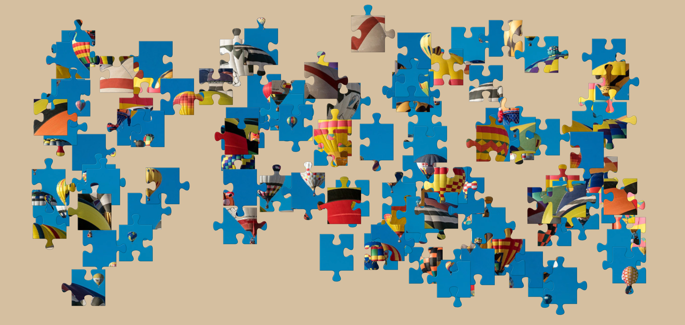
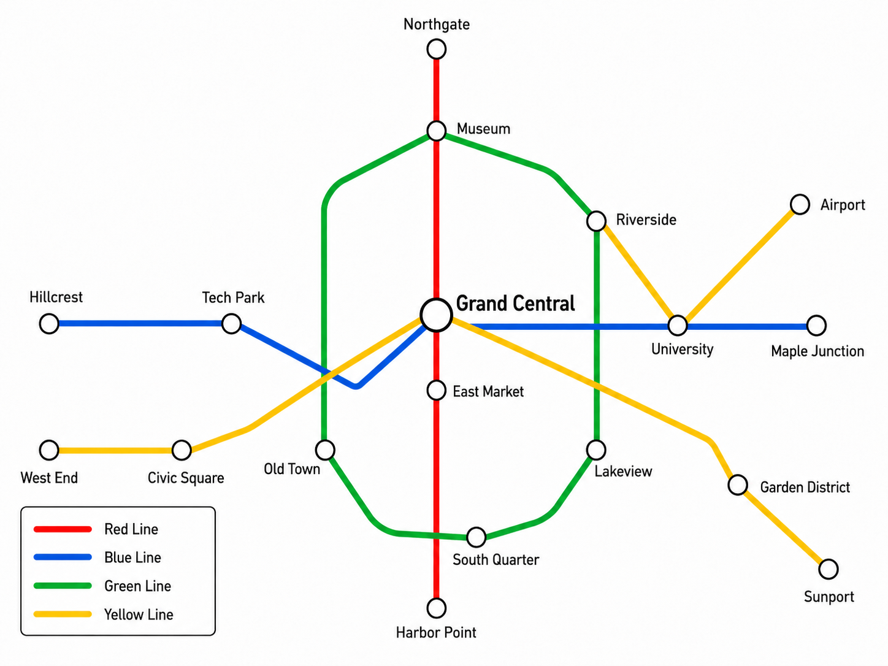
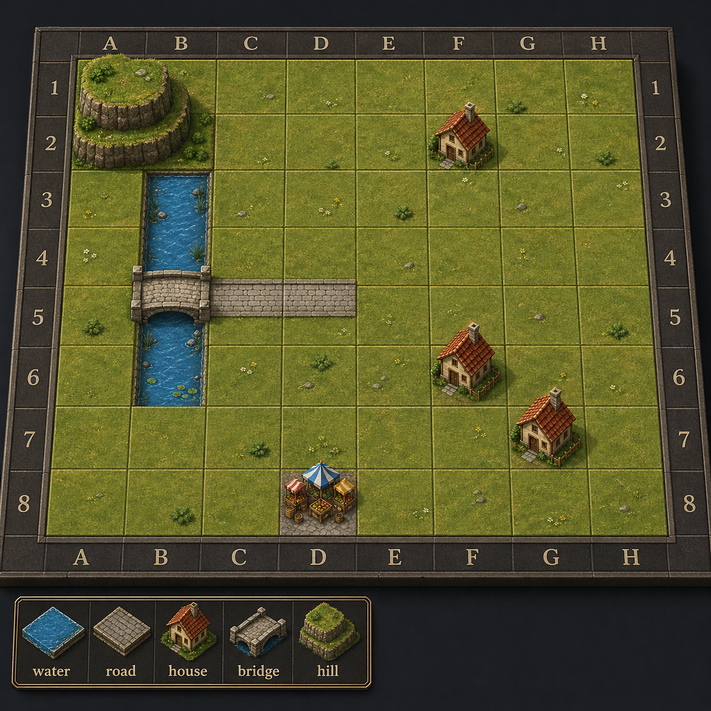
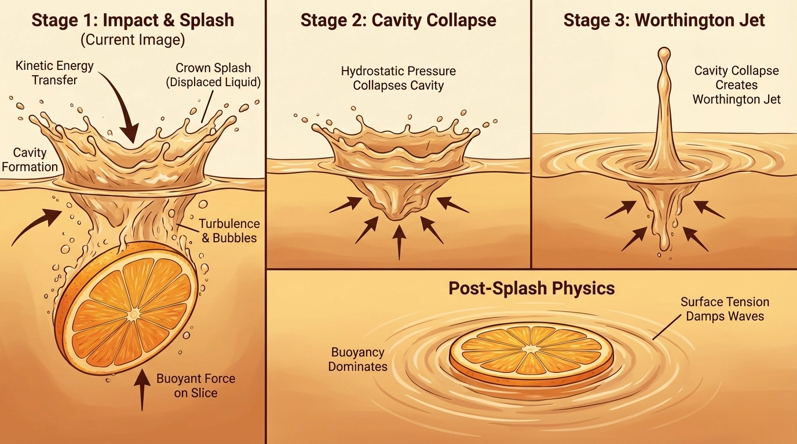
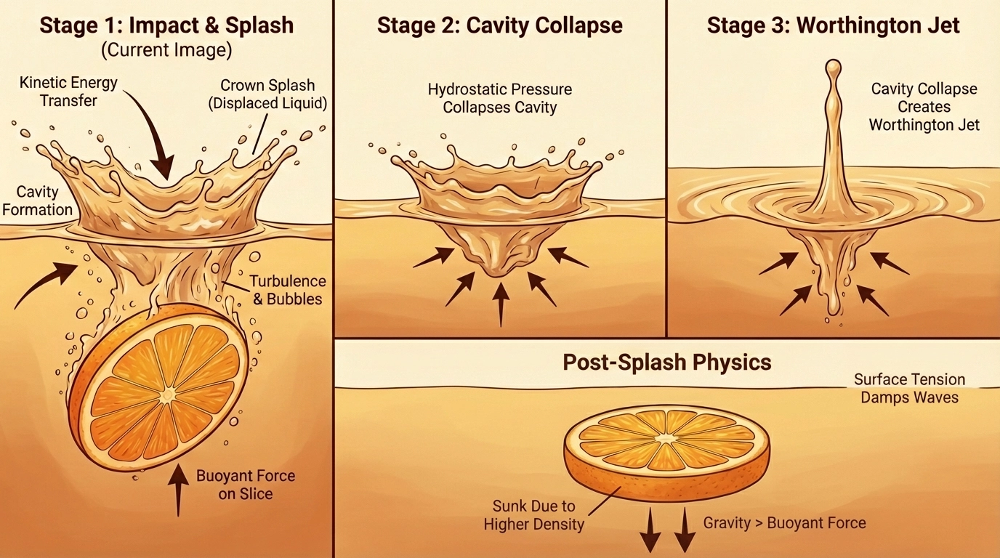

# Stress Tests

The survey pairs benchmark review with in-the-wild stress tests. These cases are not meant to be a replacement for quantitative benchmarks; they are diagnostic probes for failure modes that standard image-quality metrics often miss.

## Why Stress Testing?

FID, CLIP-score, and broad prompt-alignment metrics mostly test L1 and parts of L2. They do not reliably reveal whether a model can:

- obey strict geometric constraints;
- preserve identity and state across turns;
- render exact text or symbols;
- respect graph topology and coordinates;
- predict physically plausible consequences of interventions;
- verify its own output before returning it.

## Spatial Structuring: Jigsaw Reconstruction

**Primary capability tested:** L2 constraint grounding and the boundary toward L5 causal/spatial logic.

The model is asked to reconstruct a jigsaw-like image from fragmented pieces. A successful solution should treat pieces as rigid objects and match edges without inventing new content.

| Input | Output | Ground Truth |
| --- | --- | --- |
|  |  |  |

**Observed failure:** the model recovers the semantic theme but hallucinates a plausible completed image instead of solving the rigid spatial reconstruction problem.

## Spatial Structuring: Metro and Tile Maps

**Primary capability tested:** L2 coordinate grounding and symbolic topology.

| Metro Map | Tile Map |
| --- | --- |
|  |  |

**Metro map failure:** the output looks like a professional transit diagram, but violates graph constraints such as transfer station membership and crossing rules.

**Tile map failure:** the map is visually coherent, but objects are placed in nearby wrong cells. Coordinates behave like soft layout hints rather than exact addresses.

## Physical Reasoning: Fluid State Transition

**Primary capability tested:** L5 causal world simulation, with L3/L4 visual-textual integration.

| Input | Analytical Explainer | Counterfactual State |
| --- | --- | --- |
|  |  |  |

The model must reason about fluid dynamics and render a counterfactual sinking state. This type of task is useful because it distinguishes appearance plausibility from causal transition fidelity.

## Stress-Test Dimensions

| Dimension | Main Question | Failure Type |
| --- | --- | --- |
| Spatial structuring | Can the model execute discrete layouts? | off-by-one placement, graph violation, geometric hallucination |
| Physical reasoning | Can the model predict consequences? | plausible but causally wrong dynamics |
| Visual-textual integration | Can the model read, reason, and write back? | OCR errors, malformed equations, invalid symbols |
| Multi-turn editing | Can the model preserve state across revisions? | identity drift, background drift, cumulative degradation |
| Data-centric visualization | Can the model ground output in data? | wrong values, wrong encoding, hallucinated labels |

## Evaluation Implication

The next generation of benchmarks should look less like image-similarity metrics and more like executable validators:

- parse diagrams into graphs;
- OCR rendered text and compare exact strings;
- validate chemistry, geometry, and layouts with domain rules;
- compare generated maps against coordinate programs;
- judge world-model rollouts by action faithfulness.
