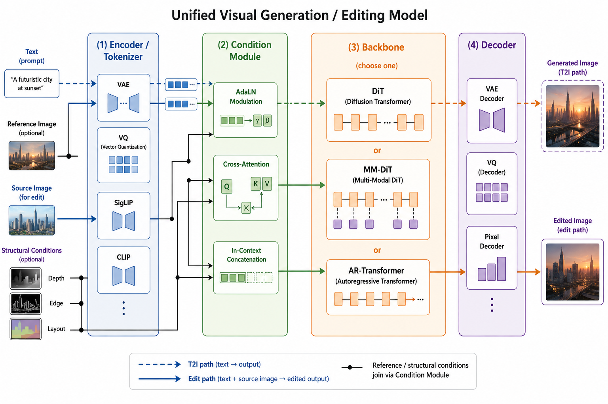

# Technical Drivers

This roadmap reads the history of visual generation as a sequence of bottleneck removals. Each paradigm remains useful, but the frontier increasingly combines them into systems that can read, plan, render, edit, and verify.

## Generative Paradigms

| Paradigm | What It Solved | Remaining Bottleneck |
| --- | --- | --- |
| GANs | Fast one-step synthesis and latent control. | Training instability, mode collapse, weaker instruction following. |
| Diffusion models | Stable scalable training and high-fidelity text-to-image generation. | High sampling cost and many sequential denoising steps. |
| Flow matching / rectified flow | Straighter transport paths and low-step generation. | Co-design of objective, sampler, and backbone remains critical. |
| Autoregressive visual models | Unified token protocols with language and multimodal reasoning. | Long visual token sequences and per-pixel fidelity. |
| Hybrid AR + diffusion/flow | Separates semantic planning from high-fidelity rendering. | System complexity and alignment between planner and renderer. |

## Component View

Modern systems can be decomposed into four recurring components:

1. **Encoder / tokenizer / VAE:** compresses pixels into a latent or token space.
2. **Backbone:** usually a transformer, DiT, MMDiT, autoregressive decoder, or hybrid architecture.
3. **Condition module:** injects prompts, references, control maps, layouts, masks, identities, and other constraints.
4. **Multimodal fusion:** determines whether understanding and generation are separate towers, shared latent spaces, or unified token streams.

## Conditioning Routes

Conditioning is no longer only a text prompt. The field increasingly uses:

- text prompts and dense captions;
- layout, segmentation, depth, Canny, pose, and edge maps;
- identity and style references;
- OCR and typography constraints;
- retrieval results, tool outputs, and external documents;
- intermediate visual plans or executable edit programs.

## Closed-Source Frontier

The strongest commercial systems often disclose behavior rather than architecture. From observed capabilities, the survey argues that they are converging toward system-level loops:

- stronger upstream VLMs parse the request and visual context;
- planner modules decompose difficult generation or editing tasks;
- renderer modules produce candidate images;
- verifier modules inspect failures and trigger revisions;
- memory and tool interfaces support longer workflows.

The open-source gap is therefore not only a model-weight gap. It is also a gap in orchestration, verification, data engines, reward models, and production inference.
