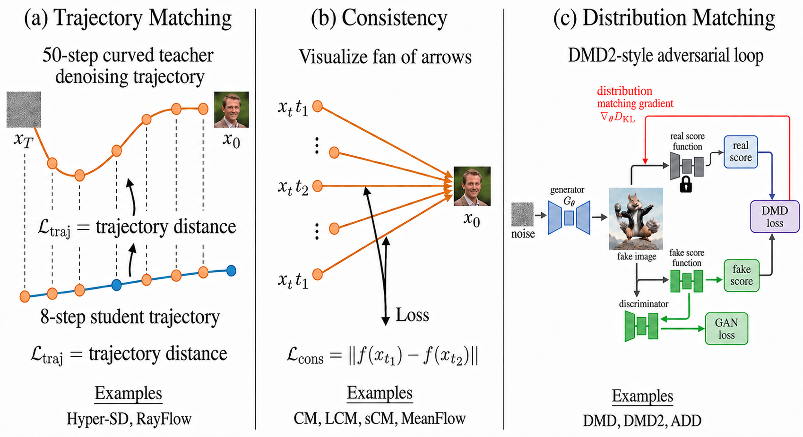

# Training, Data, and Alignment

The survey argues that modern visual foundation models are no longer improved by scale alone. Their capability ceiling is increasingly determined by data density, caption quality, long-tail curation, post-training, reward modeling, and inference acceleration.

## Three-Stage Training Lifecycle

| Stage | Role | Key Mechanisms |
| --- | --- | --- |
| Pre-training | Builds the broad visual prior. | Web-scale data, filtering, recaptioning, curriculum learning, continued training. |
| Post-training | Turns a broad prior into a user-aligned generator. | SFT, DPO-style preference optimization, GRPO-style RL, reward models, VLM-as-judge. |
| Inference acceleration | Makes generation usable as an interactive interface. | Few-step solvers, pruning, caching, quantization, distillation. |

## Data Construction Shift

The field has moved from passive web scraping toward actively engineered data engines.

The common five-stage pattern is:

1. **Source data acquisition:** real images, user-generated edits, videos, 3D assets, structured graphics, and code-rendered diagrams.
2. **Instruction and caption construction:** VLM-based annotation, LLM seed expansion, human labeling, OCR-focused recaptioning, and structured reasoning traces.
3. **Generation or editing:** frontier-model distillation, open-source pipelines, temporal pair extraction, human editing, programmatic rendering, and 3D rendering.
4. **Quality control:** perceptual filters, semantic VLM checks, reward-model scoring, human review, and failure-aware filtering.
5. **Dataset assembly:** packaging, splits, metadata, licensing, and downstream task balancing.

## Captioning as Supervision

Caption progress has become a major training lever. Dense VLM recaptioning, OCR-first annotation, structured captions, spatial relation descriptions, and multi-level labels often determine whether a model learns attributes, text, layout, and task intent. The practical lesson is that a better captioning and filtering pipeline can outperform simply increasing parameter count.

## Synthetic Data and Distillation

Synthetic data now appears in several forms:

- **Frontier model distillation:** proprietary generators produce high-quality targets for training open or compact models.
- **Open-source pipeline synthesis:** FLUX, SDXL, inpainting, segmentation, ControlNet, IP-Adapter, and task-specific tools create reproducible training data.
- **Programmatic rendering:** Python, LaTeX, charting libraries, 3D engines, and layout programs generate verifiable visual artifacts.
- **Reward-guided generation:** reward models or VLM judges filter and improve candidate samples.
- **Self-play:** generators and judges co-evolve, with the risk of distribution collapse if external grounding is weak.

## Alignment for Generative Trajectories

Preference optimization for diffusion and flow models is not just classification over final images. The reward signal must be assigned across a long denoising or transport trajectory. This motivates:

- offline preference learning through DPO-style objectives;
- online RL with group-relative or reward-model-guided updates;
- dense reward views that score intermediate denoising states;
- task-specific reward models for editing, text rendering, and physical correctness.

## Acceleration as a Capability Requirement

Closed-loop and agentic generation require low-latency visual actions. Acceleration is therefore not only a deployment detail; it determines whether a generator can participate in interactive planning, verification, and revision loops.
